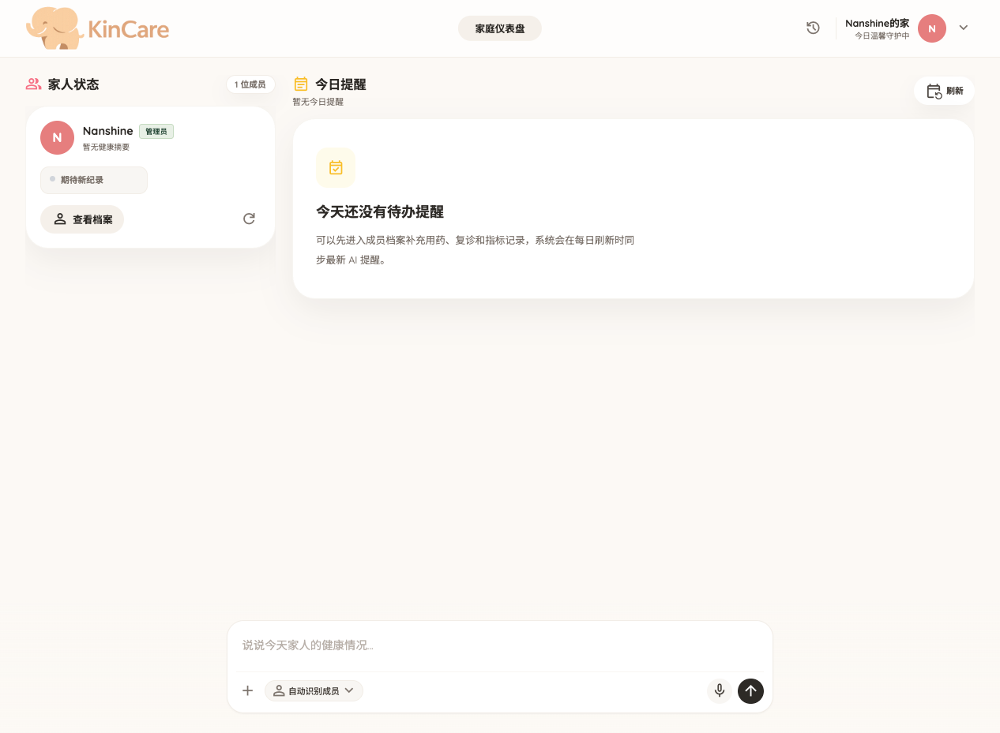

#  KinCare

**Self-hosted family health space powered by AI**

[中文](./README.zh-CN.md) | English

<p>
  
</p>

<p align="center"><strong>Connection · Insight · Care</strong></p>

- **Connection** — Bring your family and their health into one shared space.
- **Insight** — Let AI uncover what you might miss.
- **Care** — Turn understanding into timely, meaningful action.

## What Is KinCare?

KinCare is a private family health space you run on your own machine or server.  
It brings your household, health records, and AI assistance into one place — so your family stays aligned without giving up control of sensitive data.

## Key Capabilities

- Family health dashboard for the whole household
- Unified health profiles for each family member across multiple record types
- AI agent with chat, voice input, and health-record draft actions
- AI-powered daily insights and reminders
- Family space with member-level permissions
- Self-hosted, privacy-first deployment

## Quick Start

KinCare's recommended install path is Docker Compose.

```bash
cp .env.example .env
# Edit .env and set at least KINCARE_JWT_SECRET
# Add AI / STT settings if you want chat, transcription, and AI generation

docker compose up -d --build
```

Then open:

- Web app: `http://localhost:8080`

## Local Development

Copy the local environment file first:

```bash
cp .env.example .env
```

Start the backend:

```bash
cd backend
UV_CACHE_DIR=/tmp/kincare-uv-cache uv venv .venv
UV_CACHE_DIR=/tmp/kincare-uv-cache uv pip install --python .venv/bin/python -r requirements.txt
.venv/bin/uvicorn app.main:app --reload
```

Start the frontend in another terminal:

```bash
cd frontend
npm ci
VITE_API_BASE_URL=http://localhost:8000 npm run dev -- --host 0.0.0.0 --port 5173
```

## Family Space And Permissions

- One deployment equals one family space.
- The first registered user becomes the family admin automatically.
- Admins can add members and manage permissions.
- Member access follows `read / write / manage` levels with scoped grants.


## Roadmap

- Integrate the OpenWearables repository to bring wearable-device data into KinCare
- Expose a local MCP service so external AI agents such as Claude Code can access family health context safely
- Support OpenClaw through skills-based integrations

## Acknowledgements

- [PydanticAI](https://ai.pydantic.dev/) for the agent framework
- [Docling](https://github.com/docling-project/docling) for document processing
- [faster-whisper](https://github.com/SYSTRAN/faster-whisper) for speech transcription

## License

TBD
